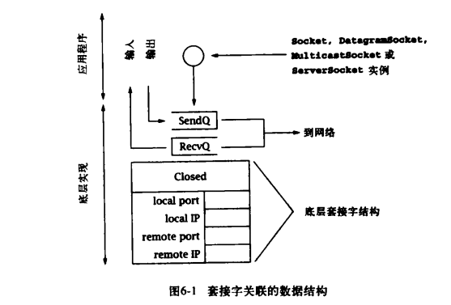
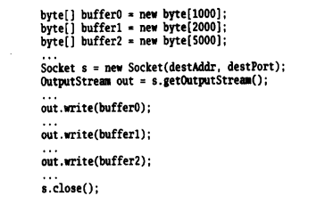
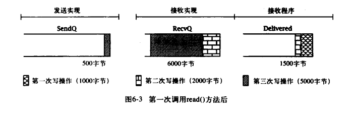
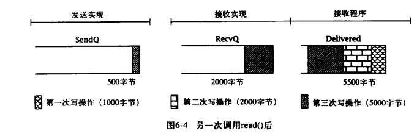

# 深入剖析 Socket——数据传输的底层实现

## 底层数据结构

如果不理解套接字的具体实现所关联的数据结构和底层协议的工作细节，就很难抓住网络编程的精妙之处，对于 TCP 套接字来说，更是如此。套接字所关联的底层的数据结构集包含了特定 Socket 实例所关联的信息。比附，套接字结构除其他信息外还包含：

- 该套接字所关联的本地和远程互联网地址和端口号。
- 一个 FIFO（First Im First Out）队列，用于存放接收到的等待分配的数据，以及一个用于存放等待传输的数据的队列。
- 对于 TCP 套接字，还包含了与打开和关闭 TCP 握手相关的额定协议状态信息。

了解这些数据结构，以及底层协议如何对其进行影响是非常有用的，因为它们控制了各种 Socket 对象行为的各个方面。例如，由于 TCP 提供了一种可信赖的字节流服务，任何写入 Socket 和 OutpitStream 的数据副本都必须保留，直到连接的另一端将这些数据成功接收。向输出流写数据并不意味着数据实际上已经被发送——它们只是被复制到了本地缓冲区，就算在 Socket 的 OutputStream 上进行 flush()操作，也不能保证数据能够立即发送到信道。此外，字节流服务的自身属性决定了其无法保留输入流中消息的边界信息。

## 数据传输的底层实现

在使用 TCP 套接字时，需要记住的最重要的一点是：不能假设在连接的一端将数据写入输出流和在另一端从输入流读出数据之间有任何的一致性。尤其是在发送端由单个输出流的 write()方法传输的数据，可能会通过另一端的多个输入流的 read()方法获取，而一个 read()方法可能会返回多个 write()方法传输的数据。

一般来讲，我们可以认为 TCP 连接上发送的所有字节序列在某一瞬间被分成了 3 个 FIFO 队列：

- SendQ：在发送端底层实现中缓存的字节，这些字节已经写入输出流，但还没在接收端成功接收。它占用大约 37KB 内存。
- RecvQ：在接收端底层实现中缓存的字节，这些字节等待分配到接收程序——即从输入流中读取。它占用大约 25KB 内存。
- Delivered：接收者从输入流已经读取到的字节。

当我们调用 OutputStream 的 write()方法时，将向 SendQ 追加字节。

TCP 协议负责将字节按顺序从 SendQ 移动到 RecvQ。这里有重要的一点需要明确：这个转移过程无法由用户程序控制或直接观察到，并且在块中发生，这些块的大小在一定程度上独立于传递给 write()方法的缓冲区大小。

接收程序从 Socket 的 InputStream 读取数据时，字节就从 RecvQ 移动到 Delivered 中，而转移的块的大小依赖于 RecvQ 中的数据量和传递给 read()方法的缓冲区的大小。

## 示例分析

为了展示这种情况，考虑如下程序：

其中，圆点代表了设置缓冲区数据的代码，但不包含对 out.write()方法的调用。这个 TCP 连接向接收端传输 8000 字节，在连接的接收端，这 8000 字节的分组方式取决于连接两端的 out.write()方法和 in.read()方法的调用时间差，以及提供给 in.read()方法的缓冲区的大小。

下图展示了 3 次调用 out.write()方法后，另一端调用 in.read()方法前，以上 3 个队列的一种可能状态。不同的阴影效果分别代表了上文中 3 次调用 write()方法传输的不同数据：

现在假设接收者调用 read()方法时使用的缓冲区数组大小为 2000 字节，read()调用则将把 RecvQ 中的 1500 字节全部移动到数组中，返回值为 1500。注意，这些数据中包含了第一次和第二次调用 write()方法时传输的字节，再过一段时间，当 TCP 连接传完更多数据后，这三部分的状态可能如下图所示：

如果接收者现在调用 read()方法时使用 4000 字节的缓冲区数组，将有很多字节从 RecvQ 队列转移到 Delivered 队列中，这包括第二次调用 write()方法时剩下的 1500 字节加上第三次调用 write()方法的钱 2500 字节。此时，队列的状态如下图：

下次调用 read()方法返回的字节数，取决于缓冲区数组的大小，亦及发送方套接字通过网络向接收方实现传输数据的时机。数据从 sendQ 到 RecvQ 缓冲区的移动过程对应用程序协议的设计有重要的指导性。

