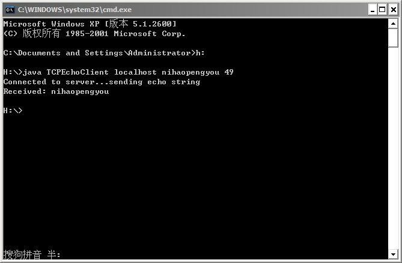
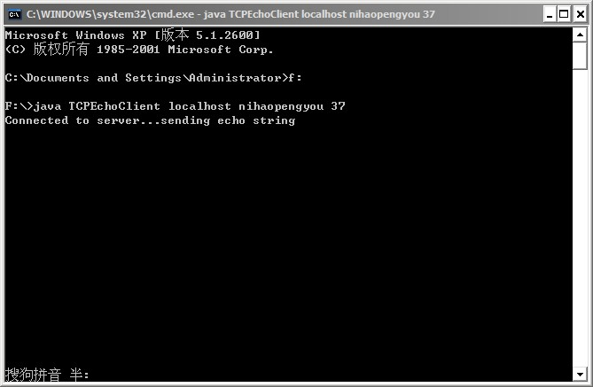
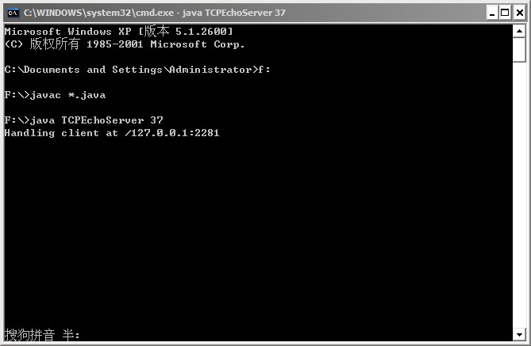
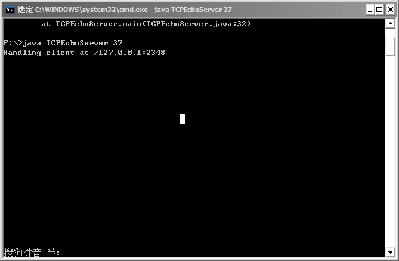
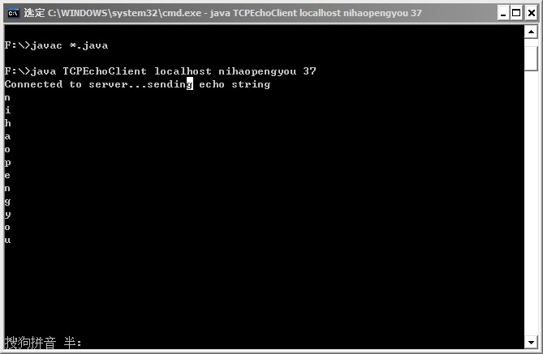
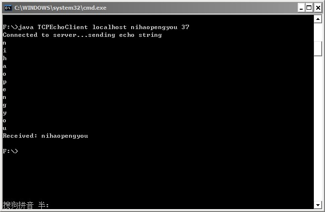
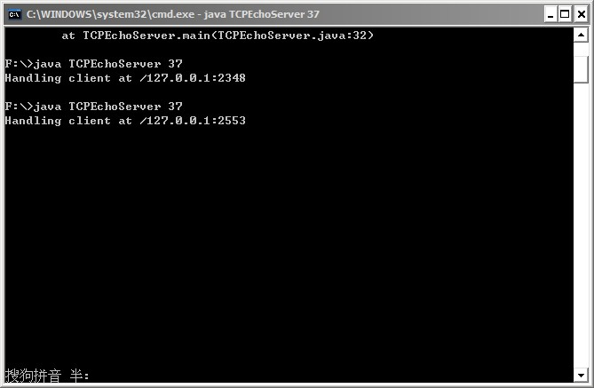

# Socket 通信中由 read 返回值造成的的死锁问题

## 示例

在第一章中，作者给出了一个 TCP Socket 通信的例子——反馈服务器，即服务器端直接把从客户端接收到的数据原原本本地反馈回去。

示例客户端代码如下：

```
import java.net.Socket;  
import java.net.SocketException;  
import java.io.IOException;  
import java.io.InputStream;  
import java.io.OutputStream;  
  
public class TCPEchoClient {  
  
    public static void main(String[] args) throws IOException {  
  
        if ((args.length < 2) || (args.length > 3))  // Test for correct # of args  
            throw new IllegalArgumentException("Parameter(s): <Server> <Word> [<Port>]");  
  
        String server = args[0];       // Server name or IP address  
        // Convert argument String to bytes using the default character encoding  
        byte[] data = args[1].getBytes();  
  
        int servPort = (args.length == 3) ? Integer.parseInt(args[2]) : 7;  
  
        // Create socket that is connected to server on specified port  
        Socket socket = new Socket(server, servPort);  
        System.out.println("Connected to server...sending echo string");  
  
        InputStream in = socket.getInputStream();  
        OutputStream out = socket.getOutputStream();  
  
        out.write(data);  // Send the encoded string to the server  
  
        // Receive the same string back from the server  
        int totalBytesRcvd = 0;  // Total bytes received so far  
        int bytesRcvd;           // Bytes received in last read  
        while (totalBytesRcvd < data.length) {  
            if ((bytesRcvd = in.read(data, totalBytesRcvd,data.length - totalBytesRcvd)) == -1)  
                throw new SocketException("Connection closed prematurely");  
            totalBytesRcvd += bytesRcvd;  
        }  // data array is full  
  
        System.out.println("Received: " + new String(data));  
  
        socket.close();  // Close the socket and its streams  
    }  
}  
```

示例服务器端代码如下：

```
import java.net.*;  // for Socket, ServerSocket, and InetAddress  
import java.io.*;   // for IOException and Input/OutputStream  
  
public class TCPEchoServer {  
  
    private static final int BUFSIZE = 32;   // Size of receive buffer  
  
    public static void main(String[] args) throws IOException {  
  
    if (args.length != 1)  // Test for correct # of args  
        throw new IllegalArgumentException("Parameter(s): <Port>");  
  
    int servPort = Integer.parseInt(args[0]);  
  
    // Create a server socket to accept client connection requests  
    ServerSocket servSock = new ServerSocket(servPort);  
  
    int recvMsgSize;   // Size of received message  
    byte[] receiveBuf = new byte[BUFSIZE];  // Receive buffer  
  
    while (true) { // Run forever, accepting and servicing connections  
        Socket clntSock = servSock.accept();     // Get client connection  
  
        SocketAddress clientAddress = clntSock.getRemoteSocketAddress();  
        System.out.println("Handling client at " + clientAddress);  
        
        InputStream in = clntSock.getInputStream();  
        OutputStream out = clntSock.getOutputStream();  
  
  
        // Receive until client closes connection, indicated by -1 return  
        while ((recvMsgSize = in.read(receiveBuf)) != -1) {  
            out.write(receiveBuf, 0, recvMsgSize);  
        }  
  
        clntSock.close();  // Close the socket.  We are done with this client!  
    }  
    /* NOT REACHED */  
  }  
}
```

运行结果如下：




## 问题的引出

明确问题

- 客户端与服务器端在接收和发送数据时，read()和write()方法不一定要对应，比如，其中一方可以一次发送多个字节的数据，而另一方可以一个字节一个字节地接收，也可以一个字节一个字节地方送，而多个字节多个字节地接收。因为TCP协议会将数据分成多个块进行发送，而后在另一端会从多个块进行接收，再组合在一起，它并不仅能确定read()和write()方法中所发送信息的界限。

- read()方法会在没有数据可读时发生阻塞，直到有新的数据可读。

注意客户端中下面部分代码。

```
while (totalBytesRcvd < data.length) {  
    if ((bytesRcvd = in.read(data, totalBytesRcvd,data.length - totalBytesRcvd)) == -1)  
        throw new SocketException("Connection closed prematurely");  
    totalBytesRcvd += bytesRcvd;  
}  // data array is full 
```

客户端从 Socket 套接字中读取数据，直到收到的数据的字节长度和原来发送的数据的字节长度相同为止，这里的前提是已经知道了要从服务器端接收的数据的大小，如果现在我们不知道要反馈回来的数据的大小，那么我们只能用 read 方法不断读取，直到 read()返回 -1，说明接收到了所有的数据。我这里采用一个字节一个字节读取的方式，代码改为如下：

```
while((bytesRcvd = in.read())!= -1){  
    data[totalBytesRcvd] = (byte)bytesRcvd;  
    totalBytesRcvd++;  
}  
```

这时问题就来了，输出结果如下：





## 问题的分析

客户端没有数据打印出来，初步推断应该是 read()方法始终没有返回 -1，导致程序一直无法往下运行，我在客客户端执行窗口中按下 CTRL+C，强制结束运行，在服务器端抛出如下异常：

```
Exception in thread "main" java.net.SocketException: Connection reset
        at java.net.SocketInputStream.read(Unknown Source)
        at java.net.SocketInputStream.read(Unknown Source)
        at TCPEchoServer.main(TCPEchoServer.java:32)
```

异常显示，问题出现在服务端的 32 行，没有资源可读，现在很有可能便是由于 read()方法始终没有返回 -1 所致，为了验证，我在客户端读取字节的代码中加入了一行打印读取的单个字符的代码，如下：

```
while((bytesRcvd = in.read())!= -1){  
    data[totalBytesRcvd] = (byte)bytesRcvd;  
    System.out.println((char)data[totalBytesRcvd]);  
    totalBytesRcvd++;  
}  
```

此时运行结果如下：





很明显，客户端程序在打印出最有一个字节后不再往下执行，没有执行其后面的 System.out.println("Received: " + new String(data))；这行代码，这是因为 read()方法已经将数据读完，没有数据可读，但又没有返回 -1，因此在此处产生了阻塞。这便造成了 TCP Socket 通信的死锁问题。

## 问题的解决

问题就出现在 read()方法上，这里的重点是 read()方法何时返回-1，在一般的文件读取中，这代表流的结束，亦即读取到了文件的末尾，但是在 Socket 套接字中，这样的概念很模糊，因为套接字中数据的末尾并没有所谓的结束标记，无法通过其自身表示传输的数据已经结束，那么究竟什么时候 read()会返回 -1 呢？答案是：当 TCP 通信连接的一方关闭了套接字时。

再次分析改过后的代码，客户端用到了read()返回 -1 这个条件，而服务端也用到了，只有二者有一方关闭了 Socket，另一方的 read()方法才会返回 -1，而在客户端打印输出前，二者都没有关闭 Socket，因此，二者的 read()方法都不会返回 -1，程序便阻塞在此处，都不往下执行，这便造成了死锁。

反过来，再看书上的给出的代码，在客户端代码的 while 循环中，我们的条件是`totalBytesRcvd < data.length`，而不是`(bytesRcvd = in.read())!= -1`，这样，客户端在收到与其发送相同的字节数之后便会退出 while 循环，再往下执行，便是关闭套接字，此时服务端的 read()方法检测到客户端的关闭，便会返回 -1，从而继续往下执行，也将套接字关闭。因此，不会产生死锁。

那么，如果在客户端不知道反馈回来的数据的情况下，该如何避免死锁呢？Java 的 Socket 类提供了 shutdownOutput()和 shutdownInput()另个方法，用来分别只关闭 Socket 的输出流和输入流，而不影响其对应的输入流和输出流，那么我们便可以在客户端发送完数据后，调用 shutdownOutput()方法将套接字的输出流关闭，这样，服务端的 read()方法便会返回 -1，继续往下执行，最后关闭服务端的套接字，而后客户端的 read()()方法也会返回 -1，继续往下执行，直到关闭套接字。

客户端改变后的代码部分如下：

```
out.write(data);  // Send the encoded string to the server  
socket.shutdownOutput();  
```

这样，便得到了预期的运行结果，如下：






## 总结

由于 read()方法只有在另一端关闭套接字的输出流时，才会返回 -1，而有时候由于我们不知道所要接收数据的大小，因此不得不用 read()方法返回 -1 这一判断条件，那么此时，合理的程序设计应该是先关闭网络输出流（亦即套接字的输出流），再关闭套接字。


