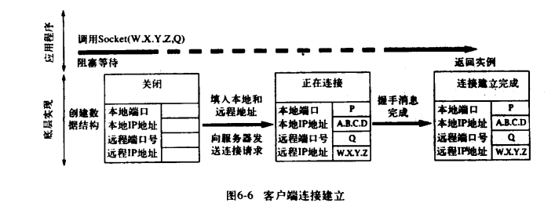
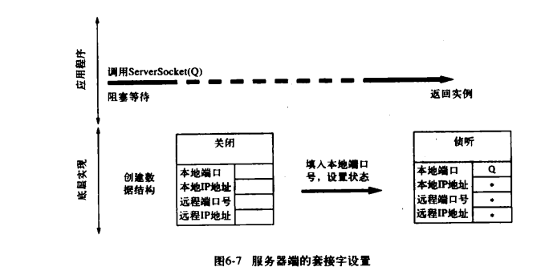
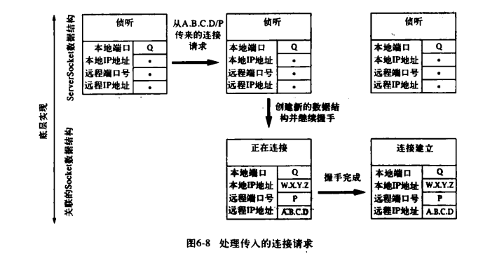
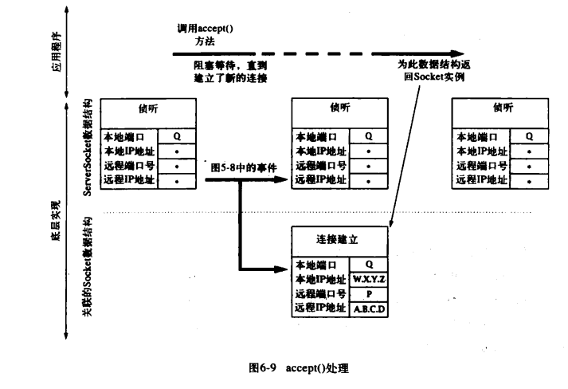
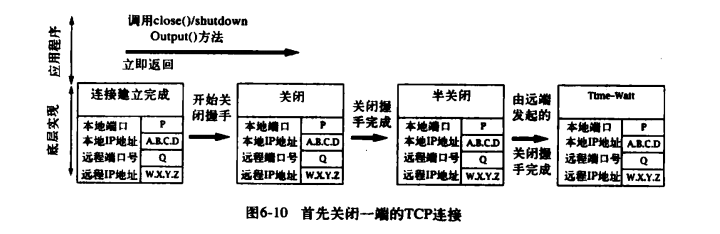
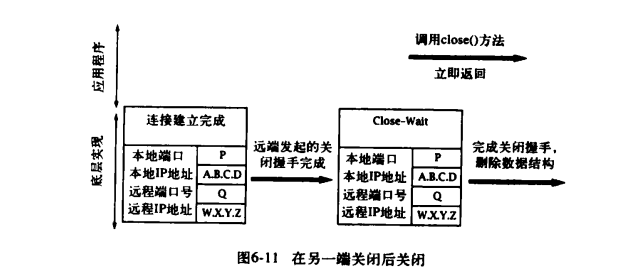

# 深入剖析 Socket——TCP 套接字的生命周期

## 建立 TCP 连接

新的 Socket 实例创建后，就立即能用于发送和接收数据。也就是说，当 Socket 实例返回时，它已经连接到了一个远程终端，并通过协议的底层实现完成了 TCP 消息或握手信息的交换。

## 客户端连接的建立

Socket 构造函数的调用与客户端连接建立时所关联的协议事件之间的关系下图所示：

当客户端以服务器端的互联网地址 W.X.Y.Z 和端口号 Q 作为参数，调用 Socket 的构造函数时，底层实现将创建一个套接字实例，该实例的初始状态是关闭的。TCP 开放握手也称为3次握手，这通常包括 3 条消息：一条从客户端到服务端的连接请求，一条从服务端到客户端的确认消息，以及另一条从客户端到服务端的确认消息。对客户端而言，一旦它收到了服务端发来的确认消息，就立即认为连接已经建立。通常这个过程发生的很快，但连接请求消息或服务端的回复消息都有可能在传输过程中丢失，因此 TCP 协议实现将以递增的时间间隔重复发送几次握手消息。如果 TCP 客户端在一段时间后还没有收到服务端的回复消息，则发生超时并放弃连接。如果服务端并没有接收连接，则服务端的 TCP 将发送一条拒绝消息而不是确认消息。

## 服务端连接的建立

当客户端的事件序列则有所不同。服务端首先创建一个 ServerSocket 实例，并将其与已知端口相关联（在此为 Q），套接字实现为新的 ServerSocket 实例创建一个底层数据结构，并就 Q 赋给本地端口，并将特定的通配符（*）赋给本地 IP 地址（服务器可能有多个 IP 地址，不过通常不会指定该参数），如下图所示：

现在服务端可以调用 ServerSocket 的 accept()方法，来将阻塞等待客户端连接请求的到来。当客户端的连接请求到来时，将为连接创建一个新的套接字数据结构。该套接字的地址根据到来的分组报文设置：分组报文的目标互联网地址和端口号成为该套接字的本地互联网地址和端口号；而分组报文的源地址和端口号则成为改套接字的远程互联网地址和端口号。注意，新套接字的本地端口号总是与 ServerSocket 的端口号一致。除了要创建一个新的底层套接字数据结构外，服务端的 TCP 实现还要向客户端发送一个 TCP 握手确认消息。如下图所示：

但是，对于服务端来说，在接收到客户端发来的第3条消息之前，服务端 TCP 并不会认为握手消息已经完成。一旦收到客户端发来的第 3 条消息，则表示连接已建立，此时一个新的数据结构将从服务端所关联的列表中移除，并为创建一个 Socke t实例，作为 accept()方法的返回值。如下图所示：

这里有非常重要的一点需要注意，在 ServerSocket 关联的列表中的每个数据结构，都代表了一个与另一端的客户端已经完成建立的 TCP 连接。实际上，客户只要收到了开放握手的第 2 条消息，就可以立即发送数据——这可能比服务端调用 accept()方法为其获取一个 Socket 实例要早很长时间。

## 关闭 TCP 连接

TCP 协议有一个优雅的关闭机制，以保证应用程序在关闭时不必担心正在传输的数据会丢失，这个机制还可以设计为允许两个方向的数据传输相互独立地终止。关闭机制的工作流程是：应用程序通过调用连接套接字的 close()方法或 shutdownOutput()方法表明数据已经发送完毕。底层 TCP 实现首先将留在 SendQ 队列中的数据传输出去（这还要依赖于另一端的 RecvQ 队列的剩余空间），然后向另一端发送一个关闭 TCP 连接的握手消息。该关闭握手消息可以看做流结束的标志：它告诉接收端 TCP 不会再有新的数据传入 RecvQ 队列了。注意：关闭握手消息本身并没有传递给接收端应用程序，而是通过 read()方法返回 -1 来指示其在字节流中的位置。而正在关闭的 TCP 将等待其关闭握手消息的确认消息，该确认消息表明在连接上传输的所有数据已经安全地传输到了 RecvQ 中。只要收到了确认消息，该连接变成了“半关闭”状态。直到连接的另一个方向上收到了对称的握手消息后，连接才完全关闭——也就是说，连接的两端都表明它们没有数据发送了。

TCP 连接的关闭事件序列可能以两种方式发生：一种方式是先由一个应用程序调用 close()方法或 shutdownOutput 方法，并在另一端调用 close()方法之前完成其关闭握手消息；另一种方式是两端同时调用 close()方法，他们的关闭握手消息在网络上交叉传输。下图展示了以第一种方式关闭连接时，发起关闭的一端底层实现中的事件序列：

>注意，如果连接处于半关闭状态时，远程终端已经离开，那么本地底层数据结构则无限期地保持在该状态。当另一端的关闭握手消息到达后，则发回一条确认消息并将状态改为“Time—Wait”。虽然应用程序中相应的 Socket 实例可能早已消失，与之关联的底层数据结构还将在底层实现中继续存留几分钟。

对于没有首先发起关闭的一端，关闭握手消息达到后，它立即发回一个确认消息，并将连接状态改为“Close—Wait”。此时，只需要等待应用程序调用 Socket 的 close()方法。调用该方法后，将发起最终的关闭消息 ，并释放底层套接字数据结构。 下图展示了没有首先发起关闭的一端底层实现中的事件序列：

>注意这样一个事实：close()方法和 shutdownOutput()方法都没有等待关闭握手的完成，而是调用后立即返回，这样，当应用程序调用 close()方法或 shutdownOutput()方法并成功关闭连接时，有可能还有数据留在 SendQ 队列中。如果连接的任何一端在数据传输到 RecvQ 队列之前崩溃，数据将丢失，而发送端应用程序却不会知道。

>最好的解决方案是设计一种应用程序协议，以使首先调用 close()方法的一方在接收到了应用程序的数据已接收保证后，才真正执行关闭操作。例如，在[《因读取返回值造成的死锁问题》](socket-read-deadlock.md)这篇文章的分析示例中，客户端程序确认其接收到的字节数与其发送的字节数相等后，它就能够知道此时在连接的两个方向上都没有数据在传输，因此可以安全地关闭连接。

关闭 TCP 连接的最后微妙之处在于对 Time—Wait 状态的需要。TCP 规范要求在终止连接时，两端的关闭握手都完成后，至少要有一个套接字在 Time—Wait 状态保持一段时间。这个要求的提出是由于消息在网络中传输时可能延迟。如果在连接两端都完成了关闭握手后，它们都移除了其底层数据结构，而此时在同样一对套接字地址之间又建立了新的连接，那么前一个连接在网络上传输时延迟的消息就可能在新建立的连接后到达。由于包含了相同的源地址和目的地址，旧消息就会被错误地认为是属于新连接的，其包含的数据就可能被错误地分配到应用程序中。虽然这种情况很少发生，TCP 还是使用了包括 Time—Write 状态在内的多种机制对其进行防范。

Time—Wait 状态最重要的作用是：只要底层套接字数据结构还存在，就不允许在相同的本地端口上关联其他套接字，尤其试图使用该端口创建新的 Socket 实例时，将抛出 IOException 异常。