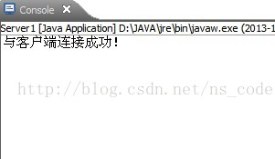

# Java TCP Socket 编程

## TCP 的 Java 支持

协议相当于相互通信的程序间达成的一种约定，它规定了分组报文的结构、交换方式、包含的意义以及怎样对报文所包含的信息进行解析，TCP/IP 协议族有 IP 协议、TCP 协议和 UDP 协议。现在 TCP/IP 协议族中的主要 socket 类型为流套接字（使用 TCP 协议）和数据报套接字（使用 UDP 协议）。 

TCP 协议提供面向连接的服务，通过它建立的是可靠地连接。Java 为 TCP 协议提供了两个类：Socke 类和 ServerSocket 类。一个 Socket 实例代表了 TCP 连接的一个客户端，而一个 ServerSocket 实例代表了 TCP 连接的一个服务器端，一般在 TCP Socket 编程中，客户端有多个，而服务器端只有一个，客户端 TCP 向服务器端 TCP 发送连接请求，服务器端的 ServerSocket 实例则监听来自客户端的 TCP 连接请求，并为每个请求创建新的 Socket 实例，由于服务端在调用 accept（）等待客户端的连接请求时会阻塞，直到收到客户端发送的连接请求才会继续往下执行代码，因此要为每个 Socket 连接开启一个线程。服务器端要同时处理 ServerSocket 实例和 Socket 实例，而客户端只需要使用 Socket 实例。另外，每个 Socket 实例会关联一个 InputStream 和 OutputStream 对象，我们通过将字节写入套接字的 OutputStream 来发送数据，并通过从 InputStream 来接收数据。

## TCP 连接的建立步骤

客户端向服务器端发送连接请求后，就被动地等待服务器的响应。典型的 TCP 客户端要经过下面三步操作：

- 创建一个 Socket 实例：构造函数向指定的远程主机和端口建立一个 TCP 连接；
- 通过套接字的 I/O 流与服务端通信；
- 使用 Socket 类的 close 方法关闭连接。 

服务端的工作是建立一个通信终端，并被动地等待客户端的连接。

典型的 TCP 服务端执行如下两步操作：

1. 创建一个 ServerSocket 实例并指定本地端口，用来监听客户端在该端口发送的 TCP 连接请求；

2. 重复执行：

 - 调用 ServerSocket 的 accept（）方法以获取客户端连接，并通过其返回值创建一个 Socket 实例；

 - 为返回的 Socket 实例开启新的线程，并使用返回的 Socket 实例的 I/O 流与客户端通信；
通信完成后，使用 Socket 类的 close（）方法关闭该客户端的套接字连接。 

## TCP Socket Demo

下面给出一个客户端服务端 TCP 通信的 Demo，该客户端在 20006 端口请求与服务端建立 TCP 连接，客户端不断接收键盘输入，并将其发送到服务端，服务端在接收到的数据前面加上“echo”字符串，并将组合后的字符串发回给客户端，如此循环，直到客户端接收到键盘输入“bye”为止。

客户端代码如下： 

```
package zyb.org.client;  
  
import java.io.BufferedReader;  
import java.io.IOException;  
import java.io.InputStreamReader;  
import java.io.PrintStream;  
import java.net.Socket;  
import java.net.SocketTimeoutException;  
  
public class Client1 {  
    public static void main(String[] args) throws IOException {  
        //客户端请求与本机在20006端口建立TCP连接   
        Socket client = new Socket("127.0.0.1", 20006);  
        client.setSoTimeout(10000);  
        //获取键盘输入   
        BufferedReader input = new BufferedReader(new InputStreamReader(System.in));  
        //获取Socket的输出流，用来发送数据到服务端    
        PrintStream out = new PrintStream(client.getOutputStream());  
        //获取Socket的输入流，用来接收从服务端发送过来的数据    
        BufferedReader buf =  new BufferedReader(new InputStreamReader(client.getInputStream()));  
        boolean flag = true;  
        while(flag){  
            System.out.print("输入信息：");  
            String str = input.readLine();  
            //发送数据到服务端    
            out.println(str);  
            if("bye".equals(str)){  
                flag = false;  
            }else{  
                try{  
                    //从服务器端接收数据有个时间限制（系统自设，也可以自己设置），超过了这个时间，便会抛出该异常  
                    String echo = buf.readLine();  
                    System.out.println(echo);  
                }catch(SocketTimeoutException e){  
                    System.out.println("Time out, No response");  
                }  
            }  
        }  
        input.close();  
        if(client != null){  
            //如果构造函数建立起了连接，则关闭套接字，如果没有建立起连接，自然不用关闭  
            client.close(); //只关闭socket，其关联的输入输出流也会被关闭  
        }  
    }  
}  
```

服务端需要用到多线程，这里单独写了一个多线程类，代码如下： 

```
package zyb.org.server;  
  
import java.io.BufferedReader;  
import java.io.InputStreamReader;  
import java.io.PrintStream;  
import java.net.Socket;  
  
/** 
 * 该类为多线程类，用于服务端 
 */  
public class ServerThread implements Runnable {  
  
    private Socket client = null;  
    public ServerThread(Socket client){  
        this.client = client;  
    }  
      
    @Override  
    public void run() {  
        try{  
            //获取Socket的输出流，用来向客户端发送数据  
            PrintStream out = new PrintStream(client.getOutputStream());  
            //获取Socket的输入流，用来接收从客户端发送过来的数据  
            BufferedReader buf = new BufferedReader(new InputStreamReader(client.getInputStream()));  
            boolean flag =true;  
            while(flag){  
                //接收从客户端发送过来的数据  
                String str =  buf.readLine();  
                if(str == null || "".equals(str)){  
                    flag = false;  
                }else{  
                    if("bye".equals(str)){  
                        flag = false;  
                    }else{  
                        //将接收到的字符串前面加上echo，发送到对应的客户端  
                        out.println("echo:" + str);  
                    }  
                }  
            }  
            out.close();  
            client.close();  
        }catch(Exception e){  
            e.printStackTrace();  
        }  
    }  
  
}  
```

服务端处理 TCP 连接请求的代码如下： 

```
package zyb.org.server;  
  
import java.net.ServerSocket;  
import java.net.Socket;  
  
public class Server1 {  
    public static void main(String[] args) throws Exception{  
        //服务端在20006端口监听客户端请求的TCP连接  
        ServerSocket server = new ServerSocket(20006);  
        Socket client = null;  
        boolean f = true;  
        while(f){  
            //等待客户端的连接，如果没有获取连接  
            client = server.accept();  
            System.out.println("与客户端连接成功！");  
            //为每个客户端连接开启一个线程  
            new Thread(new ServerThread(client)).start();  
        }  
        server.close();  
    }  
}  
```

执行结果截图如下：


