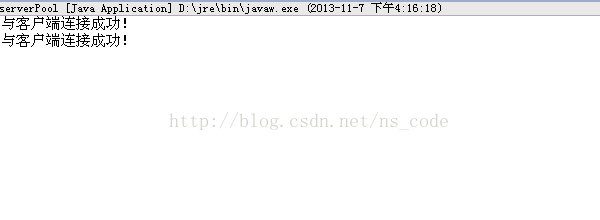
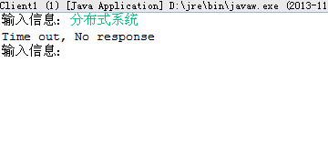
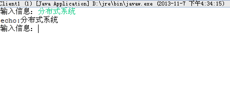

# 基于线程池的 TCP 服务器

## 线程池

在 [Java TCP Socket 编程](tcp.md)这篇文章中，服务器端采用的实现方式是：一个客户端对应一个线程。但是，每个新线程都会消耗系统资源：创建一个线程会占用 CPU 周期，而且每个线程都会建立自己的数据结构（如，栈），也要消耗系统内存，另外，当一个线程阻塞时，JVM 将保存其状态，选择另外一个线程运行，并在上下文转换（context switch）时恢复阻塞线程的状态。随着线程数的增加，线程将消耗越来越多的系统资源，这将最终导致系统花费更多的时间来处理上下文转换盒线程管理，更少的时间来对连接进行服务。在这种情况下，加入一个额外的线程实际上可能增加客户端总服务的时间。

我们可以通过限制线程总数并重复使用线程来避免这个问题。我们让服务器在启动时创建一个由固定线程数量组成的线程池，当一个新的客户端连接请求传入服务器，它将交给线程池中的一个线程处理，该线程处理完这个客户端之后，又返回线程池，继续等待下一次请求。如果连接请求到达服务器时，线程池中所有的线程都已经被占用，它们则在一个队列中等待，直到有空闲的线程可用。

实现步骤

- 与一客户一线程服务器一样，线程池服务器首先创建一个 ServerSocket 实例。
- 然后创建 N 个线程，每个线程反复循环，从（共享的）ServerSocket 实例接收客户端连接。当多个线程同时调用一个 ServerSocket 实例的 accept()方法时，它们都将阻塞等待，直到一个新的连接成功建立，然后系统选择一个线程，为建立起的连接提供服务，其他线程则继续阻塞等待。
- 线程在完成对一个客户端的服务后，继续等待其他的连接请求，而不终止。如果在一个客户端连接被创建时，没有线程在 accept()方法上阻塞（即所有的线程都在为其他连接服务），系统则将新的连接排列在一个队列中，直到下一次调用 accept()方法。

## 示例代码

我们依然实现 [Java TCP Socket 编程](tcp.md)这篇文章中的功能，客户端代码相同，服务器端代码在其基础上改为基于线程池的实现，为了方便在匿名线程中调用处理通信细节的方法，我们对多线程类 ServerThread 做了一些微小的改动，如下：

```
package zyb.org.server;  
  
import java.io.BufferedReader;  
import java.io.InputStreamReader;  
import java.io.PrintStream;  
import java.net.Socket;  
  
/** 
 * 该类为多线程类，用于服务端 
 */  
public class ServerThread implements Runnable {  
  
    private Socket client = null;  
    public ServerThread(Socket client){  
        this.client = client;  
    }  
       
    //处理通信细节的静态方法，这里主要是方便线程池服务器的调用  
    public static void execute(Socket client){  
        try{  
            //获取Socket的输出流，用来向客户端发送数据    
            PrintStream out = new PrintStream(client.getOutputStream());  
            //获取Socket的输入流，用来接收从客户端发送过来的数据  
            BufferedReader buf = new BufferedReader(new InputStreamReader(client.getInputStream()));  
            boolean flag =true;  
            while(flag){  
                //接收从客户端发送过来的数据    
                String str =  buf.readLine();  
                if(str == null || "".equals(str)){  
                    flag = false;  
                }else{  
                    if("bye".equals(str)){  
                        flag = false;  
                    }else{  
                        //将接收到的字符串前面加上echo，发送到对应的客户端    
                        out.println("echo:" + str);  
                    }  
                }  
            }  
            out.close();  
            buf.close();  
            client.close();  
        }catch(Exception e){  
            e.printStackTrace();  
        }  
    }  
    @Override  
    public void run() {  
        execute(client);  
    }  
  
}  
```

这样我们就可以很方便地在匿名线程中调用处理通信细节的方法，改进后的服务器端代码如下：

```
package zyb.org.server;  
  
import java.io.IOException;  
import java.net.ServerSocket;  
import java.net.Socket;  
  
/** 
 * 该类实现基于线程池的服务器 
 */  
public class serverPool {  
      
    private static final int THREADPOOLSIZE = 2;  
  
    public static void main(String[] args) throws IOException{  
        //服务端在20006端口监听客户端请求的TCP连接   
        final ServerSocket server = new ServerSocket(20006);  
          
        //在线程池中一共只有THREADPOOLSIZE个线程，  
        //最多有THREADPOOLSIZE个线程在accept()方法上阻塞等待连接请求  
        for(int i=0;i<THREADPOOLSIZE;i++){  
            //匿名内部类，当前线程为匿名线程，还没有为任何客户端连接提供服务  
            Thread thread = new Thread(){  
                public void run(){  
                    //线程为某连接提供完服务后，循环等待其他的连接请求  
                    while(true){  
                        try {  
                            //等待客户端的连接  
                            Socket client = server.accept();  
                            System.out.println("与客户端连接成功！");  
                            //一旦连接成功，则在该线程中与客户端通信  
                            ServerThread.execute(client);  
                        } catch (IOException e) {  
                            e.printStackTrace();  
                        }  
                    }   
                }  
            };  
            //先将所有的线程开启  
            thread.start();  
        }  
    }  
}  
   
```

## 结果分析

为了便于测试，程序中，我们将线程池中的线程总数设置为 2，这样，服务器端最多只能同事连接 2 个客户端，如果已有 2 个客户端与服务器建立了连接，当我们打开第 3 个客户端的时候，便无法再建立连接，服务器端不会打印出第 3 个“与客户端连接成功！”的字样。



这第 3 个客户端如果过了一段时间还没接收到服务端发回的数据，便会抛出一个 SocketTimeoutException 异常，从而打印出如下信息：



如果在抛出 SocketTimeoutException 异常之前，有一个客户端的连接关掉了，则第 3 个客户端便会与服务器端建立起连接，从而收到返回的数据。



## 改进

在创建线程池时，线程池的大小是个很重要的考虑因素，如果创建的线程太多（空闲线程太多），则会消耗掉很多系统资源，如果创建的线程太少，客户端还是有可能等很长时间才能获得服务。因此，线程池的大小需要根据负载情况进行调整，以使客户端连接的时间最短，理想的情况是有一个调度的工具，可以在系统负载增加时扩展线程池的大小（低于大上限值），负载减轻时缩减线程池的大小。一种解决的方案便是使用 Java 中的 Executor 接口。

Executor 接口代表了一个根据某种策略来执行 Runnable 实例的对象，其中可能包括了排队和调度等细节，或如何选择要执行的任务。Executor 接口只定义了一个方法：

```
interface Executor{

      void execute(Runnable task);

}
```

Java 提供了大量的内置 Executor 接口实现，它们都可以简单方便地使用，ExecutorService 接口继承于Executor 接口，它提供了一个更高级的工具来关闭服务器，包括正常的关闭和突然的关闭。我们可以通过调用Executors 类的各种静态工厂方法来获取 ExecutorService 实例，而后通过调用 execute（）方法来为需要处理的任务分配线程，它首先会尝试使用已有的线程，但如果有必要，它会创建一个新的线程来处理任务，另外，如果一个线程空闲了 60 秒以上，则将其移出线程池，而且任务是在 Executor 的内部排队，而不像之前的服务器那样是在网络系统中排队，因此，这个策略几乎总是比前面两种方式实现的 TCP 服务器效率要高。

改进的代码如下：

```
package zyb.org.server;  
  
import java.io.IOException;  
import java.net.ServerSocket;  
import java.net.Socket;  
import java.util.concurrent.Executor;  
import java.util.concurrent.Executors;  
  
/** 
 * 该类通过Executor接口实现服务器 
 */  
public class ServerExecutor {  
  
    public static void main(String[] args) throws IOException{  
        //服务端在20006端口监听客户端请求的TCP连接   
        ServerSocket server = new ServerSocket(20006);  
        Socket client = null;  
        //通过调用Executors类的静态方法，创建一个ExecutorService实例  
        //ExecutorService接口是Executor接口的子接口  
        Executor service = Executors.newCachedThreadPool();  
        boolean f = true;  
        while(f){  
            //等待客户端的连接  
            client = server.accept();  
            System.out.println("与客户端连接成功！");  
            //调用execute()方法时，如果必要，会创建一个新的线程来处理任务，但它首先会尝试使用已有的线程，  
            //如果一个线程空闲60秒以上，则将其移除线程池；  
            //另外，任务是在Executor的内部排队，而不是在网络中排队  
            service.execute(new ServerThread(client));  
        }   
        server.close();  
    }  
}  
```
