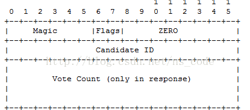

# 构建和解析自定义协议消息

在传输消息时，用 Java 内置的方法和工具确实很用，如：对象序列化，RMI 远程调用等。但有时候，针对要传输的特定类型的数据，实现自己的方法可能更简单、容易或有效。下面给出一个实现了自定义构建和解析协议消息的 Demo。

该例子是一个简单的投票协议。这里，一个客户端向服务器发送一个请求消息，消息中包含了一个候选人的 ID，范围在 0~1000。程序支持两种请求：一种是查询请求，即向服务器询问候选人当前获得的投票总数，服务器发回一个响应消息，包含了原来的候选人 ID 和该候选人当前获得的选票总数；另一种是投票请求，即向指定候选人投一票，服务器对这种请求也发回响应消息，包含了候选人 ID 和获得的选票数（包含了刚刚投的一票）。

在实现一个协议时，一般会定义一个专门的类来存放消息中所包含的的信息。在我们的例子中，客户端和服务端发送的消息都很简单，唯一的区别是服务端发送的消息还包含了选票总数和一个表示相应消息的标志。因此，可以用一个类来表示客户端和服务端的两种消息。下面的 VoteMsg.java 类展示了每条消息中的基本信息：

- 布尔值 isInquiry，true 表示该消息是查询请求，false 表示该消息是投票请求；
- 布尔值 isResponse，true 表示该消息是服务器发送的相应消息，false 表示该消息为客户端发送的请求消息；
- 整型变量 candidateID,指示了候选人的 ID；
- 长整型变量 voteCount，指示出所查询的候选人获得的总选票数。

另外，注意一下几点：

- candidateID 的范围在 0~1000；
- voteCount 在请求消息中必须为 0；
- voteCount 不能为负数。

VoteMsg 代码如下：

```
public class VoteMsg {  
  private boolean isInquiry; // true if inquiry; false if vote  
  private boolean isResponse;// true if response from server  
  private int candidateID;   // in [0,1000]  
  private long voteCount;    // nonzero only in response  
  
  public static final int MAX_CANDIDATE_ID = 1000;  
  
  public VoteMsg(boolean isResponse, boolean isInquiry, int candidateID, long voteCount)  
      throws IllegalArgumentException {  
    // check invariants  
    if (voteCount != 0 && !isResponse) {  
      throw new IllegalArgumentException("Request vote count must be zero");  
    }  
    if (candidateID < 0 || candidateID > MAX_CANDIDATE_ID) {  
      throw new IllegalArgumentException("Bad Candidate ID: " + candidateID);  
    }  
    if (voteCount < 0) {  
      throw new IllegalArgumentException("Total must be >= zero");  
    }  
    this.candidateID = candidateID;  
    this.isResponse = isResponse;  
    this.isInquiry = isInquiry;  
    this.voteCount = voteCount;  
  }  
  
  public void setInquiry(boolean isInquiry) {  
    this.isInquiry = isInquiry;  
  }  
  
  public void setResponse(boolean isResponse) {  
    this.isResponse = isResponse;  
  }  
  
  public boolean isInquiry() {  
    return isInquiry;  
  }  
  
  public boolean isResponse() {  
    return isResponse;  
  }  
  
  public void setCandidateID(int candidateID) throws IllegalArgumentException {  
    if (candidateID < 0 || candidateID > MAX_CANDIDATE_ID) {  
      throw new IllegalArgumentException("Bad Candidate ID: " + candidateID);  
    }  
    this.candidateID = candidateID;  
  }  
  
  public int getCandidateID() {  
    return candidateID;  
  }  
  
  public void setVoteCount(long count) {  
    if ((count != 0 && !isResponse) || count < 0) {  
      throw new IllegalArgumentException("Bad vote count");  
    }  
    voteCount = count;  
  }  
  
  public long getVoteCount() {  
    return voteCount;  
  }  
  
  public String toString() {  
    String res = (isInquiry ? "inquiry" : "vote") + " for candidate " + candidateID;  
    if (isResponse) {  
      res = "response to " + res + " who now has " + voteCount + " vote(s)";  
    }  
    return res;  
  }  
}  
```

接下来，我们要根据一定的协议来对其进行编解码，我们定义一个 VoteMsgCoder 接口，它提供了对投票消息进行序列化和反序列化的方法。toWrie（）方法用于根据一个特定的协议，将投票消息转换成一个字节序列，fromWire（）方法则根据相同的协议，对给定的字节序列进行解析，并根据信息的内容返回一个该消息类的实例。

```
import java.io.IOException;  
  
public interface VoteMsgCoder {  
  byte[] toWire(VoteMsg msg) throws IOException;  
  VoteMsg fromWire(byte[] input) throws IOException;  
}  
```

面给出两个实现了 VoteMsgCoder 接口的类，一个实现的是基于文本的编码方式 ，一个实现的是基于二进制的编码方式。

首先是用文本方式对消息进行编码的程序。该协议指定使用 ASCII 字符集对文本进行编码。消息的开头是一个所谓的”魔术字符串“，即一个字符序列，用于快速将投票协议的消息和网络中随机到来的垃圾消息区分开，投票/查询布尔值被编码为字符形似，‘v’代表投票消息，‘i’代表查询消息。是否为服务器发送的响应消息，由字符‘R’指示，状态标记后面是候选人 ID，其后跟的是选票总数，它们都编码成十进制字符串。

```
import java.io.ByteArrayInputStream;  
import java.io.IOException;  
import java.io.InputStreamReader;  
import java.util.Scanner;  
  
public class VoteMsgTextCoder implements VoteMsgCoder {  
  /* 
   * Wire Format "VOTEPROTO" <"v" | "i"> [<RESPFLAG>] <CANDIDATE> [<VOTECNT>] 
   * Charset is fixed by the wire format. 
   */  
  
  // Manifest constants for encoding  
  public static final String MAGIC = "Voting";  
  public static final String VOTESTR = "v";  
  public static final String INQSTR = "i";  
  public static final String RESPONSESTR = "R";  
  
  public static final String CHARSETNAME = "US-ASCII";  
  public static final String DELIMSTR = " ";  
  public static final int MAX_WIRE_LENGTH = 2000;  
  
  public byte[] toWire(VoteMsg msg) throws IOException {  
    String msgString = MAGIC + DELIMSTR + (msg.isInquiry() ? INQSTR : VOTESTR)  
        + DELIMSTR + (msg.isResponse() ? RESPONSESTR + DELIMSTR : "")  
        + Integer.toString(msg.getCandidateID()) + DELIMSTR  
        + Long.toString(msg.getVoteCount());  
    byte data[] = msgString.getBytes(CHARSETNAME);  
    return data;  
  }  
  
  public VoteMsg fromWire(byte[] message) throws IOException {  
    ByteArrayInputStream msgStream = new ByteArrayInputStream(message);  
    Scanner s = new Scanner(new InputStreamReader(msgStream, CHARSETNAME));  
    boolean isInquiry;  
    boolean isResponse;  
    int candidateID;  
    long voteCount;  
    String token;  
  
    try {  
      token = s.next();  
      if (!token.equals(MAGIC)) {  
        throw new IOException("Bad magic string: " + token);  
      }  
      token = s.next();  
      if (token.equals(VOTESTR)) {  
        isInquiry = false;  
      } else if (!token.equals(INQSTR)) {  
        throw new IOException("Bad vote/inq indicator: " + token);  
      } else {  
        isInquiry = true;  
      }  
  
      token = s.next();  
      if (token.equals(RESPONSESTR)) {  
        isResponse = true;  
        token = s.next();  
      } else {  
        isResponse = false;  
      }  
      // Current token is candidateID  
      // Note: isResponse now valid  
      candidateID = Integer.parseInt(token);  
      if (isResponse) {  
        token = s.next();  
        voteCount = Long.parseLong(token);  
      } else {  
        voteCount = 0;  
      }  
    } catch (IOException ioe) {  
      throw new IOException("Parse error...");  
    }  
    return new VoteMsg(isResponse, isInquiry, candidateID, voteCount);  
  }  
}  
```

toWire（）方法简单地创建一个字符串，该字符串中包含了消息的所有字段，并由空白符隔开。fromWire（）方法首先检查”魔术字符串“，如果在消息最前面没有魔术字符串，则抛出一个异常。在理说明了在实现协议时非常重要的一点：永远不要对从网络中来的任何输入进行任何假设。你的程序必须时刻为任何可能的输入做好准备，并能很好的对其进行处理。

下面将展示基于二进制格式对消息进行编码的程序。与基于文本的格式相反，二进制格式使用固定大小的消息，每条消息由一个特殊字节开始，该字节的最高六位为一个”魔术值“010101，该字节的最低两位对两个布尔值进行了编码，消息的第二个字节总是 0，第三、四个字节包含了 candidateID 值，只有响应消息的最后 8 个字节才包含了选票总数信息。字节序列格式如下图所示：



代码如下：

```
import java.io.ByteArrayInputStream;  
import java.io.ByteArrayOutputStream;  
import java.io.DataInputStream;  
import java.io.DataOutputStream;  
import java.io.IOException;  
  
public class VoteMsgBinCoder implements VoteMsgCoder {  
  
  // manifest constants for encoding  
  public static final int MIN_WIRE_LENGTH = 4;  
  public static final int MAX_WIRE_LENGTH = 16;  
  public static final int MAGIC = 0x5400;  
  public static final int MAGIC_MASK = 0xfc00;  
  public static final int MAGIC_SHIFT = 8;  
  public static final int RESPONSE_FLAG = 0x0200;  
  public static final int INQUIRE_FLAG =  0x0100;  
  
  public byte[] toWire(VoteMsg msg) throws IOException {  
    ByteArrayOutputStream byteStream = new ByteArrayOutputStream();  
    DataOutputStream out = new DataOutputStream(byteStream); // converts ints  
  
    short magicAndFlags = MAGIC;  
    if (msg.isInquiry()) {  
      magicAndFlags |= INQUIRE_FLAG;  
    }  
    if (msg.isResponse()) {  
      magicAndFlags |= RESPONSE_FLAG;  
    }  
    out.writeShort(magicAndFlags);  
    // We know the candidate ID will fit in a short: it's > 0 && < 1000   
    out.writeShort((short) msg.getCandidateID());  
    if (msg.isResponse()) {  
      out.writeLong(msg.getVoteCount());  
    }  
    out.flush();  
    byte[] data = byteStream.toByteArray();  
    return data;  
  }  
  
  public VoteMsg fromWire(byte[] input) throws IOException {  
    // sanity checks  
    if (input.length < MIN_WIRE_LENGTH) {  
      throw new IOException("Runt message");  
    }  
    ByteArrayInputStream bs = new ByteArrayInputStream(input);  
    DataInputStream in = new DataInputStream(bs);  
    int magic = in.readShort();  
    if ((magic & MAGIC_MASK) != MAGIC) {  
      throw new IOException("Bad Magic #: " +  
                ((magic & MAGIC_MASK) >> MAGIC_SHIFT));  
    }  
    boolean resp = ((magic & RESPONSE_FLAG) != 0);  
    boolean inq = ((magic & INQUIRE_FLAG) != 0);  
    int candidateID = in.readShort();  
    if (candidateID < 0 || candidateID > 1000) {  
      throw new IOException("Bad candidate ID: " + candidateID);  
    }  
    long count = 0;  
    if (resp) {  
      count = in.readLong();  
      if (count < 0) {  
        throw new IOException("Bad vote count: " + count);  
      }  
    }  
    // Ignore any extra bytes  
    return new VoteMsg(resp, inq, candidateID, count);  
  }  
}  
```


